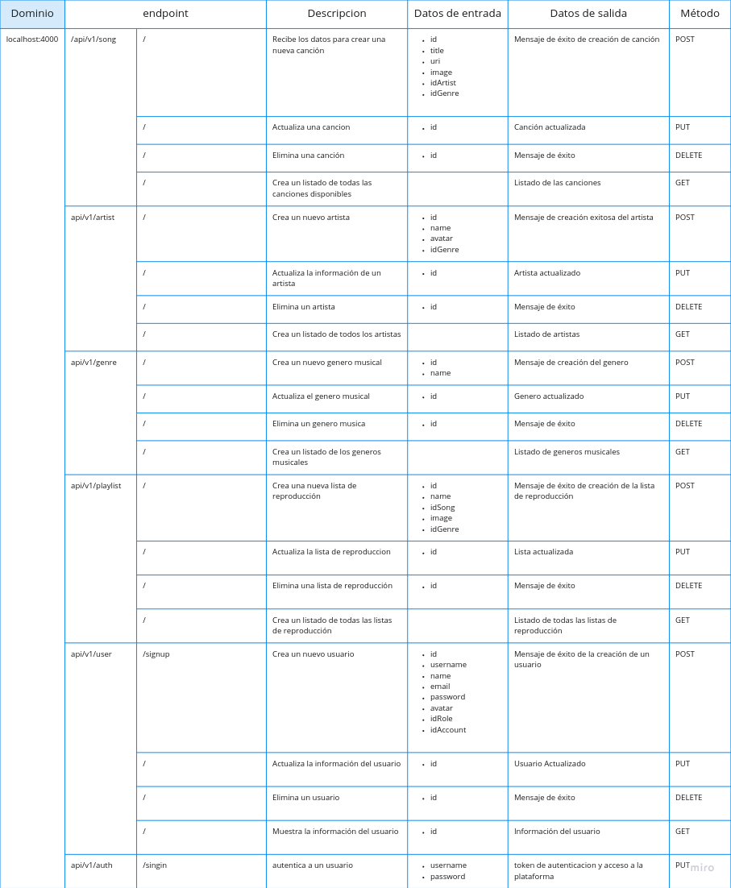
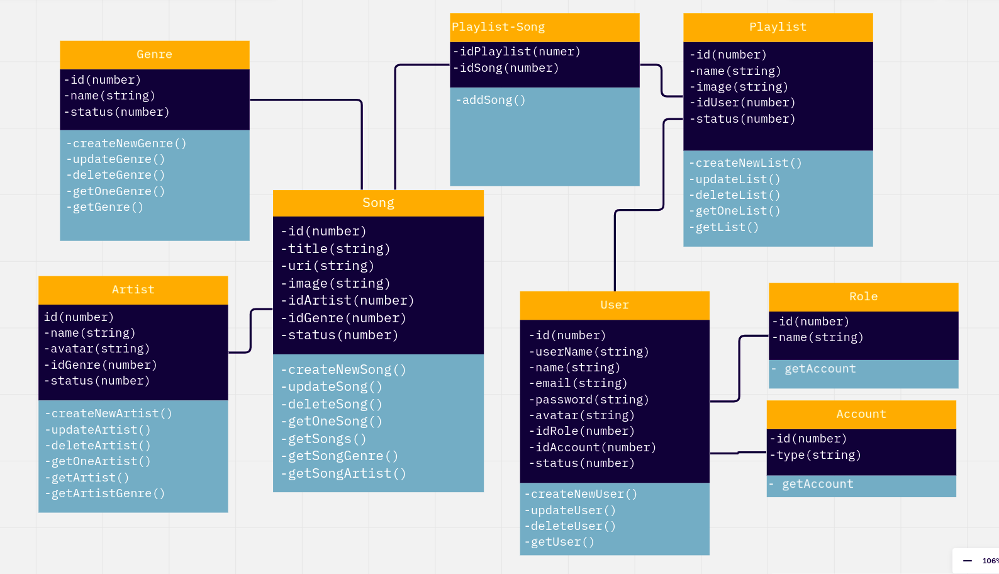

# Titulo: Spotplay
---
## Overview:
Spotplay es una nueva compañía de música online que tiene como objetivo proporcionar mejores relaciones con los artistas y fans. 

Su producto es _Spotplay_, una plataforma en la que las personas pueden generar  listas de reproducción para sus artistas favoritos y gustos musicales. 

### Alcance(Scope)
    - La apliación tendra acceso para usuarios consumidores, a travez de su registro.
    - La apliación tendra acceso para usuarios editores, para dar mantenimiento a la apliacion.

#### Casos de uso
* Se pueden crear usuarios de tipo lector y de tipo editor
* El usuario lector puede buscar las canciones disponibles dentro de la plataforma
* El usuario lector puede buscar a los artistas disponibles en la plataforma
* El usuario lector puede buscar los generos musicales disponibles en la plataforma
* El usuario lector puede crear una nueva lista con un nombre dado y actualizar el nombre si fuera necesario
* El usuario lector puede eliminar sus listas creadas
* El usuairo lector puede obtener las listas de reproduccion de los usuarios.
* El usuario lector puede agregar y eliminar canciones a sus listas de reproduccion
* El usuario editor puede crear actualizar eliminar y buscar canciones dentro de la plataforma
* El usuario editor puede crear actualizar eliminar y buscar artistas dentro de la plataforma
* El usuario editor puede crear actualizar eliminar y buscar generos musicales dentro de la plataforma
* El usuario editor puede crear actualizar eliminar y buscar las listas de reproduccion disponibles  dentro de la plataforma
* El usuario editor puede crear agregar y eliminar canciones de las listas de reproduccion

#### Out of Scope (casos de uso No Soportados)

* El usuario no puede acceder con cuantas de terceros(google, facebook).
* El usuiaro lector no puede eliminar ni actualizar canciones
* El usuiaro lector no puede eliminar ni actualizar artistas
* El usuiaro lector no puede eliminar ni actualizar generos musicales
* Los usuarios no pueden actualizar su informacion
*
---
## Arquitectura

### Diagramas
 
 - Diseño de api

- Entidades

---
## Limitaciones
Lista de limitaciones conocidas. Puede ser en formato de lista.
Ej.
* Llamadas del API tienen latencia X
* No se soporta mas de X llamadas por segundo
---
## Costo
Descripcion  de costos
Ejemplo:
"Considerando N usuarios diarios, M llamadas a X servicio/baseDatos/etc"
* 1000 llamadas diarias a serverless functions. $XX.XX
* 1000 read/write units diarias a X Database on-demand. $XX.XX
Total: $xx.xx (al mes/dia/año)